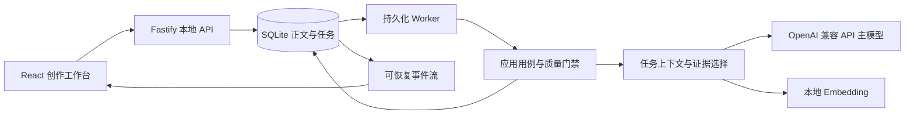
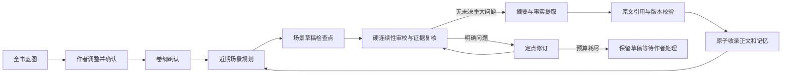

# 架构与约定

## 产品目标

单用户、本机、多作品的中文长篇创作工作台。创作约定、全书蓝图、每卷卷纲由作者确认，常规场景与章节自动推进。系统支持百万字数据与持续任务；完整百万字文学质量需另行实写、审校和人工验收。

## 模块与依赖

`web → HTTP → application → domain`。数据库和模型是注入的适配模块，Worker 与 HTTP 服务共用用例和领域契约。`pnpm check` 检查领域与用例对 UI、SDK、数据库的反向依赖。

选择模块化单体和独立 Worker，避免首版引入 Redis、独立向量库、云服务与自治多 Agent 协调。规划、写作、审校、提取分别使用新上下文。主模型任务在共享数据库队列中全局串行；不同数据目录中的评测任务不会自动参与同一队列，应避免并行跑实模评测与生产任务。

SQLite 是唯一持久化真相。Drizzle 负责类型化基础查询；全文索引、原子任务状态和受控事务使用显式 SQL，维护在基础设施模块。实体/项目扩展字段使用 JSON 载荷，主键、版本、章节顺序、外键、任务唯一性与搜索索引保持关系型约束。

## 正文、设定与记忆

每次保存创建新的正文修订。当前正文、历史版本与模型预览相互分离。模型建议不是正式稿。编辑器支持自然段编辑，当前正文以纯文本保存，格式化标记不作为小说事实。

正式记忆每项包含来源章节及版本、连续原文引用、引用位置、人物/物品主体、属性、值、类型、知识持有人、故事时间与叙述章节。引用位置使用该版本字符串的 UTF-16 偏移；字数另按 Unicode 字母/数字统计。事实、状态、人物信念、知识、承诺与关系分别表示。

摘要在章节通过审校后由当前原文生成，绑定原文版本。修改前文后，其后的状态可能受影响，因此首版保守使下游章节和记忆全部失效，直到按顺序复核。它可能比精细依赖分析多标记一些章节，避免漏掉隐含依赖。设定卡修改按生效章节标记影响；明确显示结果，不声称语义依赖识别完整。

记忆提取使用原文证据校验，人物信念/知识必须有持有人；这能保证引用存在，不能机械证明引用蕴含每个提取结论。同模型提取与审校仍需人工抽查，尤其涉及不可靠叙述、谎言与复杂时序时。

检索先按作品、正文状态、版本和叙述位置过滤，实体规则按生效区间选择；正文全文检索使用中文单字/双字索引及英文词。向量精确搜索与 BM25 用 RRF 融合。适用于当前单机百万字规模；未引入 ANN。查询结果包括来源，不把相似度当作事实置信度。

倒叙分别记录“故事时间”和“读者看到的章节”。故事时间首版是保留不确定性的文本字段，尚非可以自动求解历法与旅行时间的约束引擎。

## 上下文与提示词

每次调用重新构建任务上下文。已确认规则、相关人物与近期状态为必需材料，历史正文证据为可选材料。输入 + 输出预算 + 安全余量的估算 token 不超过运行时上限和应用 cap 中较小者。必须材料超限明确失败，可选资料逐项舍弃并记录。

上下文资料使用来源标头和直接可读内容，实体、状态投影不携带数据库时间戳、项目主键等无关字段，也不把 JSON 再编码为带转义的 JSON 字符串。完整原始对象仍保存在数据库；任务上下文只保留需要理解和引用的内容。

当前采用三章滚动规划，但每章正式完成后重新根据最新状态规划。远期方向由全书蓝图/卷纲维持。计划不会自动被当作已发生事实。

提示词按任务版本化，配置可调整采样、预算和重试。资料区明确与任务指令隔离。没有把 shell、任意 HTTP 请求或 SQL 执行工具暴露给模型。

主模型通过 OpenAI 兼容 REST API 接入（`/v1/chat/completions` 流式补全、`/v1/embeddings`、`/v1/models`），适配模块不绑定具体供应商：LM Studio、Ollama、vLLM 或云端 API 只需在配置中改地址、Key 与模型标识。请求带 `stream: true`，增量解析 SSE 分片（含 CRLF 分隔）；`finish_reason` 映射完成状态，`length` 视为截断。结构化输出默认使用 `response_format: json_object`，可配置为 `json_schema` 或仅靠提示词约束，兼容不支持 JSON 模式的服务；解析前统一剥离代码围栏与前后噪声。思考控制按配置透传 `reasoning` 参数，并在线过滤 `<think>…</think>` 分片，标签跨分片也不会泄漏到正文。API 没有统一 tokenizer 端点，预算计数使用中文约一字一位、其他约三字符一位的估算，配合安全余量使用。取消通过 AbortSignal 直接中止 HTTP 请求；连接失败与 429/5xx 映射为可重试错误，其余 4xx 视为配置错误不重试。协议分片过滤器有独立回归测试。

## 任务状态与恢复

任务状态：queued → running → completed / awaiting_approval / paused / failed / cancelled。确认仅用于蓝图和卷纲。写作使用场景检查点；作者可以检查结果、修改指令后新建任务。

Worker 持有有期限的租约并持续心跳。过期任务转为暂停，等待用户恢复。正式写入校验 Worker 所有权、租约、取消请求与作品版本。正文、有效记忆、摘要、状态、进度检查点和收录事件在同一事务提交。推理可能重做，正式收录不能重复。数据库提交后崩溃，从已提交检查点继续，不重新提交章节。

运行中暂停在下一个检查点生效，取消通过 AbortSignal 中止当前推理请求。浏览器关闭不取消 Worker。应用退出时中止自身请求并保存检查点；启动脚本只处理自己创建的进程组。

Embedding 属于派生索引，失败不会回滚已收录正文，写入 `index.pending` 事件。用户可重建索引；前台明确说明当前降级。主模型运行失败不触发自动卸载、改权重或关闭资源门禁。

## 数据迁移和备份

迁移按版本事务执行；未来增加迁移前应使用 SQLite 一致性备份。JSON 便携备份恢复成全新项目标识，保留正文版本和有效记忆并重新映射引用。SQLite 备份包含完整任务和运行记录，恢复时停止服务并检查完整性。

## 研究参考与边界

- [OpenAI Chat Completions](https://platform.openai.com/docs/api-reference/chat/streaming)：流式补全、`finish_reason` 与 `response_format` 约束；本适配遵循该协议而非特定实现。
- [OpenAI Embeddings](https://platform.openai.com/docs/api-reference/embeddings)：向量检索接口。
- [Effective context engineering](https://www.anthropic.com/engineering/effective-context-engineering-for-ai-agents)：按需检索、状态外置与上下文管理。
- [Re3](https://aclanthology.org/2022.emnlp-main.296/)：规划、当前状态注入、修订的长故事生成思路；不作为百万字有效性的证据。
- [Qwen Embedding GGUF](https://huggingface.co/Qwen/Qwen3-Embedding-0.6B-GGUF)：本地中文语义检索模型。

## 分层压缩与收束

正式章节摘要是第一层；`DigestBuilder` 以可配置的有限分组归纳为卷内摘要、卷摘要，再归纳为全书摘要。上层提示只携带分组摘要，完整原文版本引用留在数据库中。节点可复用，暂停后不重复生成已完成节点。来源章节修改或变为待复核后，相关节点立即退出有效检索。

章节完成卷纲时自动更新摘要，也可从记忆页手动更新。全书收束任务先建立有效层级，再逐组审计承诺、人物弧、连续性和结局，最后检查全书方向。它输出“需回到原文核查的候选事项”，不能把摘要未提及等同于原文未发生。摘要、全书审计和语义向量都是派生资料，不会自行改写正式设定。

人物/世界设定每个字段可标记仅供作者规划与审校。正文上下文会隐藏这些字段，包括全文检索返回的同一张卡，避免从另一条检索路径绕过。其他人物的信念/知识记忆不会直接注入当前视角；计划中的揭示必须说明获取动作。这个投影能减少知识泄漏，不能证明模型每一句话都遵守限知视角。自由文本描述和先前正文仍需要作者妥善标记、审校。

## 审校及修改权限

机器审校意见必须引用正文连续原话，引用不成立会反馈重试。重大意见再交给单独上下文核实；明显不成立的意见降为提示并记录原意见和依据，未决或确认的重大问题继续阻止收录。确定性发现不受模型复核覆盖。

自动修订仅允许替换正文中唯一的连续片段；重叠或模糊锚点拒绝写入。修订后重新审校，预算用尽则保留草稿并停止。作者明确发起的改写/润色仍返回完整建议稿，采用时检查原始作品版本。

蓝图、卷纲的编辑是待确认方案编辑，保留前后内容；保存不会隐式采用。重新确认全书蓝图会使已有正文进入复核流程。导入正文整体在事务内保存，顺序收录任务按章节提交已完成进度，遇到重大问题停在该章。

## 当前尚未声称解决的事项

- 文学质量及百万字语义连续性不是确定性校验可以证明的属性；同一 27B 模型的审校与复核仍存在相关错误。
- 事实的属性与名称允许自由文本。实体卡有稳定 ID，自动提取的主体/属性尚没有完整的跨别名语义归一引擎。
- 故事时间是文本，未实现历法、旅行时间和物理资源的通用约束求解。
- 部分修改采用保守全下游失效，尚非最小依赖图修复。
- 全书审计基于层级摘要并给出来源回查项，不替代逐字人工通读。
- 多人协作、云端同步、局域网公开服务、出版社排版和自主自治 Agent 群不在此版本范围。
